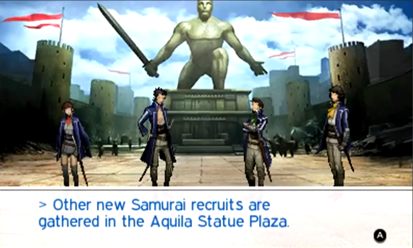
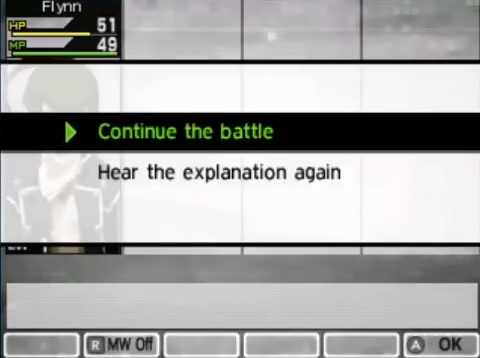
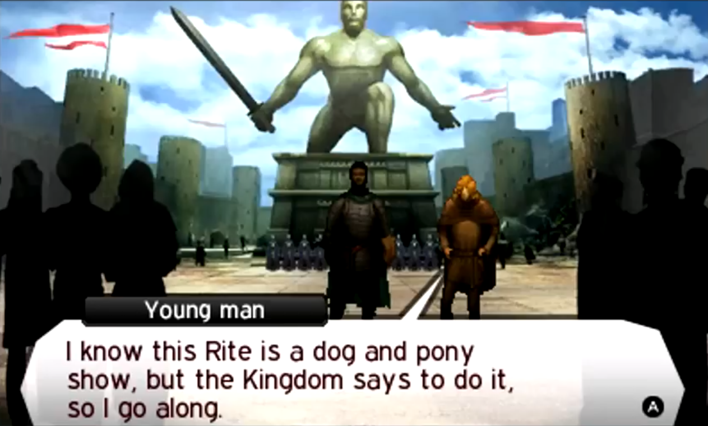
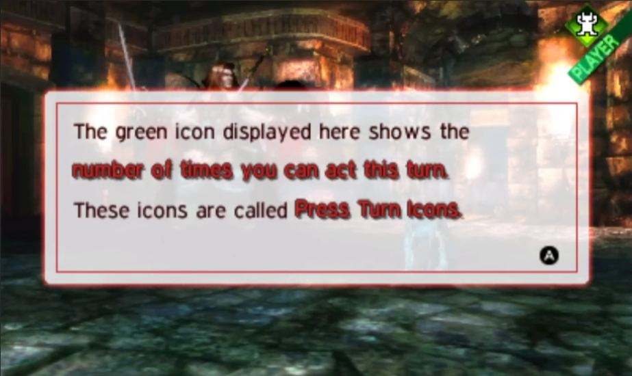
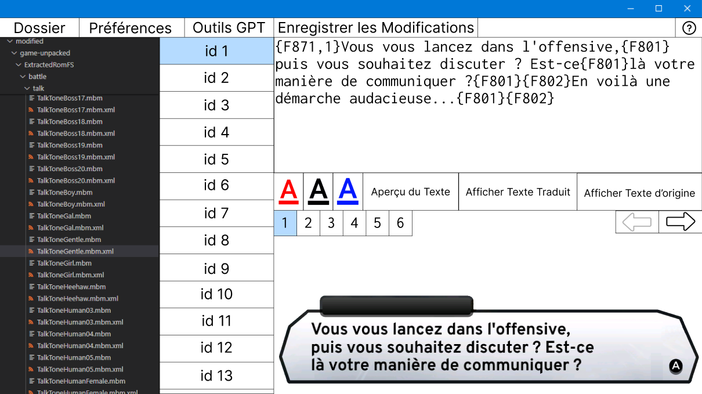

# Mbm Editor for Shin Megami Tensei IV

___

## Introduction

This software allows you to modify mbm files from the game **Shin Megami Tensei IV**, which contain lines of dialogue or certain in-game explanations.

To do so, you need to use the converter [Moonbeam](https://github.com/Megaflan/Moonbeam), which lets you transcribe mbm files to xml files. The Mbm editor allows you to modify these xml files with a dedicated interface.

___

## Interface Explanation

The Mbm editor for SMT IV enables you to select a directory and choose different xml files. You can then select the id you want to edit and modify it directly on the bottom right part of the screen.
You'll be able to switch between different text displays depending on the type of dialogue you're editing. The display varies for quests or character dialogues.

| Type        | Example                                                                         |
|-------------|---------------------------------------------------------------------------------|
| Explanation |  |
| Choice      |            |
| Dialogue    |         |
| Quest       |              |
| Tutorial    |        |

___

## High-Fidelity Prototype

This is the prototype for our software, made with `Figma`. As you can see, all the functionalities described previously are present in this prototype.

- **ID Selection**: You can select different `id`s to choose various lines in the file.
- **Text Modification**: You can modify the text line directly on the lower part of the screen with a text area.
- **Dialogue Navigation**: When there are multiple dialogue boxes to display, you can navigate through them using the arrows in the right-hand corner.
- **Text Customization**: You can change the text color, which can be useful for different contexts. You can also switch the view between the original text and your translation.
- **Toolbar Functions**: The toolbar at the top of the screen allows you to change the directory you're working on, modify parameters, save your modifications, and use `GPT tools`.

With the integration of `ChatGPT`, you can use it for purposes such as translation or correction. Different models will be available, such as providing 10 propositions to select the best one.